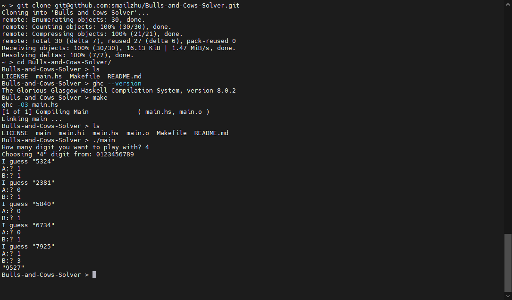

A solver for [Bulls and Cows](https://en.wikipedia.org/wiki/Bulls_and_Cows)

Bulls = correct code, correct position.
Cows = correct code, wrong position.

Bulls mark as 'A' in response, cows mark as 'B' in response.

## Screenshot

